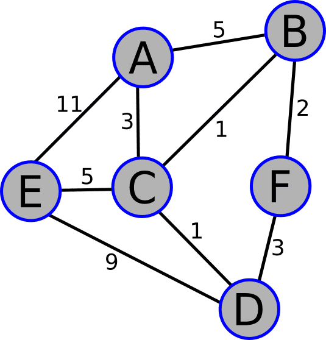

# Aprenda a diseñar algoritmos creando un algoritmo de ruta más corta

Los algoritmos son procedimientos paso a paso que los desarrolladores utilizan para realizar cálculos y resolver problemas computacionales.

En este proyecto, aprenderás a utilizar funciones, bucles, sentencias condicionales y comprensiones de diccionario para implementar un algoritmo de ruta más corta

---

## Paso 1

Hasta ahora, ya has conocido diferentes tipos de datos:

- Tipos de datos inmutables, como enteros, cadenas, tuplas y booleanos.
- Tipos de datos mutables, como listas y diccionarios.
Un diccionario se identifica mediante un par de llaves, `{}`.

> Comience creando una variable llamada `copper` y asígnele un diccionario vacío utilizando un par de llaves, del mismo modo que crearía una lista vacía con un par de corchetes.

- **Codigo**
  
  ```py
  copper = {}
  ```

---

## Paso 2

Los diccionarios almacenan datos en forma de pares *key-value*. Una clave se separa del valor correspondiente mediante dos puntos. Y cada par *clave-valor* se separa del siguiente par mediante una coma:

- **Codigo Ejemplo**
  
  ```py
  my_dict = {
      'name': 'Michael',
      'occupation': 'Lumberjack'
  }
  ```

> Agrega un nuevo par clave-valor a tu diccionario. Usa la cadena `'species'` como clave y la cadena `'guinea pig'` como valor.

- **Codigo**
  
  ```py
  copper = {"species": "guinea pig"}
  ```

---

## Paso 3

Las claves deben ser únicas dentro de un diccionario y solo pueden ser tipos de datos inmutables. Esto significa que no se puede utilizar una lista u otro diccionario como claves.

> Añada otra clave `'age'` a su diccionario y asígnele el número entero `2` como valor.

- **Codigo**
  
  ```py
  copper = {
      "species": "guinea pig",
      "age": 2
  }
  ```

---

## Paso 4

Puede acceder a los datos almacenados en un diccionario a través de sus claves:

- **Codigo Ejemplo**
  
  ```py
  my_dict = {
      'name': 'Michael',
      'occupation': 'Lumberjack'
  }
  
  my_dict['name'] # 'Michael'
  ```

Después de crear tu diccionario, sigue el ejemplo anterior para acceder a la clave `'species'` de `copper` e imprimir el resultado.

- **Codigo**
  
  ```py
  copper = {
      "species": "guinea pig",
      "age": 2
  }

  print(copper['species'])
  # ----Salida esperada----
  # guinea pig
  ```

---

## Paso 5

> Ahora, modifique su llamada `print()` existente para imprimir el valor de la clave `age`.

- **Codigo**
  
  ```py
  copper = {
      "species": "guinea pig",
      "age": 2
  }

  print(copper['age'])
  # ----Salida esperada----
  # 2
  ```

---

## Paso 6

Para agregar un nuevo par *clave-valor* después de declarar un diccionario, puede indicar la clave de la misma manera que accedería a una clave existente y establecer el valor de la nueva clave utilizando el operador de asignación:

- **Codigo Ejemplo**
  
  ```py
  my_dict = {
      'name': 'Michael',
      'occupation': 'Lumberjack'
  }
  
  my_dict['country'] = 'Canada'
  ```

> Elimine la llamada a `print()`. A continuación, después de la declaración `copper`, añada la clave `food` a su diccionario y establezca su valor en `hay`.

- **Codigo**
  
  ```py
  copper = {
      "species": "guinea pig",
      "age": 2
  }

  copper['food'] = 'hay'
  # ----Salida esperada----
  
  ```

---

## Paso 7

> Ahora, al final del código, imprima[`print()`] `copper`.

- **Codigo**
  
  ```py
  copper = {
      "species": "guinea pig",
      "age": 2
  }
  copper['food'] = 'hay'

  print(copper)
  # ----Salida esperada----
  # {'species': 'guinea pig', 'age': 2, 'food': 'hay'}
  
  ```

---

## Paso 8

Se puede utilizar la misma sintaxis para cambiar el valor de una clave existente.

> Justo antes de la llamada a `print()`, acceda a la clave `'species'` y reasigne su valor a `'Cavia porcellus'`.

- **Codigo**
  
  ```py
  copper = {
      "species": "guinea pig",
      "age": 2
  }
  copper['food'] = 'hay'
  copper['species'] = 'Cavia porcellus'

  print(copper)
  # ----Salida esperada----
  # {'species': 'Cavia porcellus', 'age': 2, 'food': 'hay'}
  
  ```

---

## Paso 9

Para iterar sobre las claves de un diccionario, simplemente puede colocar el diccionario en un bucle `for`. El siguiente código imprimiría cada clave del diccionario `dict`:

- **Codigo Ejemplo**
  
  ```py
  for i in dict:
      print(i)
  ```

> Reemplaza la llamada a `print()` por un bucle `for` que itera sobre `copper` e imprime cada tecla.

- **Codigo**
  
  ```py
  # Región editable por el usuario
  copper = {
      "species": "guinea pig",
      "age": 2
  }
  copper['food'] = 'hay'
  copper['species'] = 'Cavia porcellus'

  for i in copper:
    print(i)
  # Región editable por el usuario

  # ----Salida esperada----
  # species
  # age
  # food
  
  ```

---

## Paso 10

Si desea iterar sobre los valores de las claves del diccionario, una forma de hacerlo es utilizar el método `.values()`.

> Modifique su bucle `for` para iterar sobre `copper.values()` en lugar de `copper` y observe el resultado.

- **Codigo**
  
  ```py
  # Región editable por el usuario
  copper = {
      "species": "guinea pig",
      "age": 2
  }
  copper['food'] = 'hay'
  copper['species'] = 'Cavia porcellus'

  for i in copper.values():
    print(i)
  # Región editable por el usuario

  # ----Salida esperada----
  # Cavia porcellus
  # 2
  # hay
  
  ```

---

## Paso 11

Por último, si desea poder recorrer los pares clave-valor, puede utilizar el método `.items()`.

> Modifique su bucle `for` para iterar sobre `copper.items()` en lugar de `copper.values()`.

- **Codigo**
  
  ```py
  # Región editable por el usuario
  copper = {
      "species": "guinea pig",
      "age": 2
  }
  copper['food'] = 'hay'
  copper['species'] = 'Cavia porcellus'

  for i in copper.items():
    print(i)
  # Región editable por el usuario

  # ----Salida esperada----
  # ('species', 'Cavia porcellus')
  # ('age', 2)
  # ('food', 'hay')
  
  ```

---

## Paso 12

Como se puede ver en el resultado, .items() crea una estructura de datos que almacena cada par clave-valor=`key-value` en una tupla distinta. Para iterar sobre los elementos de esas tuplas, se puede añadir una segunda variable de bucle:

- **Codigo Ejemplo**
  
  ```py
  for i, j in dict.items():
      print(i, j)
  ```

> Modifique su bucle `for` para que tome dos variables de bucle e imprima ambas dentro del cuerpo del bucle.

- **Codigo**
  
  ```py
  # Región editable por el usuario
  copper = {
      "species": "guinea pig",
      "age": 2
  }
  copper['food'] = 'hay'
  copper['species'] = 'Cavia porcellus'

  for i, j in copper.items():
    print(i, j)
  # Región editable por el usuario

  # ----Salida esperada----
  # species Cavia porcellus
  # age 2
  # food hay
  
  ```

---

## Paso 13

Puede eliminar un par clave-valor de un diccionario utilizando la palabra clave `del`:

- **Codigo Ejemplo**
  
  ```py
  my_dict = {
      'name': 'Michael',
      'occupation': 'Lumberjack'
  }
  
  del my_dict['occupation']
  ```

> Justo antes del bucle `for`, usa la palabra clave `del` para eliminar la clave `'age'` y su valor de `copper`.

- **Codigo**
  
  ```py
  # Región editable por el usuario
  copper = {
      "species": "guinea pig",
      "age": 2
  }
  copper['food'] = 'hay'
  copper['species'] = 'Cavia porcellus'

  del copper["age"]

  for i, j in copper.items():
    print(i, j)
  # Región editable por el usuario

  # ----Salida esperada----
  # species Cavia porcellus
  # food hay
  
  ```

---

## Paso 14

Ahora que ha revisado los aspectos básicos de los diccionarios, puede continuar con la creación del algoritmo del camino más corto.

> Elimine todas las líneas de código después de la declaración del diccionario `copper`.

- **Codigo**
  
  ```py
  copper = {
      "species": "guinea pig",
      "age": 2
  }
  # Región editable por el usuario
  
  # Región editable por el usuario

  # ----Salida esperada----
  
  ```

---

## Paso 15

Los grafos son estructuras de datos que representan relaciones entre pares de elementos. Estos elementos, llamados *nodos*, pueden ser objetos de la vida real, entidades, puntos en el espacio u otros. Las conexiones entre los *nodos* se denominan `edges`.

A continuación se muestra una representación visual de  `my_graph`:



> Rename the `copper` dictionary into `my_graph`. This will represent the `graph` to test your algorithm.

- **Codigo**
  
  ```py
  # Región editable por el usuario
  my_graph = {
      "species": "guinea pig",
      "age": 2
  }
  # Región editable por el usuario
  
  # ----Salida esperada----
  
  ```

---

## Paso 16

Por ejemplo, se puede utilizar un gráfico para representar dos puntos en el espacio, `A` y `B`, conectados por un camino. Un gráfico como este estará formado por dos *nodos* conectados por un borde.

> Reemplaza la clave `'species'` existente por la cadena `'A'`. A continuación, reemplaza el valor correspondiente por la cadena `'B'` para representar la conexión entre los *nodes* `'A'` y `'B'`.

- **Codigo**
  
  ```py
  # Región editable por el usuario
  my_graph = {
      "A": "B",
      "age": 2
  }
  # Región editable por el usuario
  
  # ----Salida esperada----

  ```

---

## Paso 17

> Reemplaza la clave `'age'` por la cadena `'B'` y establece su valor en la cadena `'A'` para representar la conexión entre los *nodes* en ambas direcciones.

- **Codigo**
  
  ```py
  # Región editable por el usuario
  my_graph = {
      "A": "B",
      "B": "A"
  }
  # Región editable por el usuario
  
  # ----Salida esperada----

  ```

---

## Paso 18

Agregue otro *node* conectado a `B` a su gráfico y llámelo `C`.

Modifique su diccionario existente para representar esta disposición: agregue otra clave 'C' a `my_graph` y asígnele el valor de la cadena `'B'`.

> Además, cambie el valor de la clave `'B'` existente por la lista `['A', 'C']` para representar las múltiples conexiones de su *node* `'B'`.

- **Codigo**
  
  ```py
  # Región editable por el usuario
  my_graph = {
      "A": "B",
      "B": ["A", "C"],
      "C": "B"
  }
  # Región editable por el usuario
  
  # ----Salida esperada----

  ```

---

## Paso 19

Agregue un último node, `'D'`, que está conectado con `'A'` y `'C'`.

> Modifique su diccionario para representar esta estructura. Una vez más, utilice una lista para representar múltiples conexiones.

- **Codigo**
  
  ```py
  # Región editable por el usuario
  my_graph = {
      "A": ["B", "D"],
      "B": ["A", "C"],
      "C": ["B", "D"],
      "D": ["A", "C"]
  }
  # Región editable por el usuario
  
  # ----Salida esperada----

  ```

---

## Paso 20

Un grafo se denomina *grafo ponderado*=(`weighted graph`) cuando sus aristas están asociadas a pesos, que representan una distancia, un tiempo u otro valor cuantitativo.

En tu caso, estos pesos serán las distancias entre cada node o punto en el espacio. Para representar un grafo ponderado, puedes modificar tu diccionario utilizando una lista de tuplas para cada valor.

El primer elemento de la tupla será el node conectado y el segundo elemento será un número entero que indicará la distancia.

> Modifique `my_graph['A']` en una lista de tuplas, teniendo en cuenta que la distancia `A-B` es `3` y la distancia `A-D` es `1`.

- **Codigo**
  
  ```py
  my_graph = {
  # Región editable por el usuario
      "A": [("B", 3), ("D", 1)],
  # Región editable por el usuario
      "B": ["A", "C"],
      "C": ["B", "D"],
      "D": ["A", "C"]
  }
  
  # ----Salida esperada----

  ```

---

## Paso 21

> Ahora modifique `my_graph['B']` en una lista de tuplas, donde el primer elemento de la tupla es el `node` conectado y el segundo elemento es la distancia. La distancia `B-C` es `4`.

- **Codigo**
  
  ```py
  my_graph = {
      "A": [("B", 3), ("D", 1)],
  # Región editable por el usuario
      "B": [("A", 3), ("C", 4)],
  # Región editable por el usuario
      "C": ["B", "D"],
      "D": ["A", "C"]
  }
  
  # ----Salida esperada----

  ```

---

## Paso 22

> Del mismo modo, modifique las dos listas restantes teniendo en cuenta que la distancia `C-D` es `7`.

- **Codigo**
  
  ```py
  my_graph = {
      "A": [("B", 3), ("D", 1)],
      "B": [("A", 3), ("C", 4)],
  # Región editable por el usuario
      "C": [("B", 4), ("D", 7)],
      "D": [("A", 1), ("C", 7)]
  # Región editable por el usuario
  }
  
  # ----Salida esperada----

  ```

---

## Paso 23

Ahora vas a empezar a desarrollar el algoritmo para calcular la ruta más corta entre cada *node* de tu nuevo gráfico.

> Declara una función vacía llamada `shortest_path`. Utiliza la palabra clave `pass` para rellenar el cuerpo de la función.

- **Codigo**
  
  ```py
  my_graph = {
      "A": [("B", 3), ("D", 1)],
      "B": [("A", 3), ("C", 4)],
      "C": [("B", 4), ("D", 7)],
      "D": [("A", 1), ("C", 7)]
  }
  # Región editable por el usuario
  def shortest_path():
      pass
  # Región editable por el usuario
  
  # ----Salida esperada----

  ```

---

## Paso 24

El algoritmo comenzará en un *node* específico. A continuación, explorará el grafo para encontrar el camino más corto entre el *node* inicial, o fuente, y todos los demás *nodes*.

> Para ello, su función necesita dos parámetros: `graph`, y `start`. Añádalos a la declaración de su función.

- **Codigo**
  
  ```py
  my_graph = {
      "A": [("B", 3), ("D", 1)],
      "B": [("A", 3), ("C", 4)],
      "C": [("B", 4), ("D", 7)],
      "D": [("A", 1), ("C", 7)]
  }
  # Región editable por el usuario
  def shortest_path(graph, start):
      pass
  # Región editable por el usuario
  
  # ----Salida esperada----

  ```

---

## Paso 25

Para llevar un registro de los *nodes* visitados, necesitas una lista de todos los nodos del grafo. Una vez que se visita un *node*, se elimina de esa lista.

> Ahora, reemplaza la palabra clave `pass` por una variable llamada `unvisited` y asígnale una lista vacía.

- **Codigo**
  
  ```py
  my_graph = {
      "A": [("B", 3), ("D", 1)],
      "B": [("A", 3), ("C", 4)],
      "C": [("B", 4), ("D", 7)],
      "D": [("A", 1), ("C", 7)]
  }
  # Región editable por el usuario
  def shortest_path(graph, start):
      unvisited = []
  # Región editable por el usuario
  
  # ----Salida esperada----

  ```

---

## Paso 26

> Cree un bucle `for` para iterar sobre su gráfico=(`graph`) y utilice el método `.append()` para añadir cada `node` al final de la lista `unvisited` no visitados.

- **Codigo**
  
  ```py
  my_graph = {
      "A": [("B", 3), ("D", 1)],
      "B": [("A", 3), ("C", 4)],
      "C": [("B", 4), ("D", 7)],
      "D": [("A", 1), ("C", 7)]
  }
  # Región editable por el usuario
  def shortest_path(graph, start):
      unvisited = []
      for node in graph:
          unvisited.append(node)
  # Región editable por el usuario
  
  # ----Salida esperada----

  ```

---

## Paso 27

Mientras el algoritmo explora el `graph`, debe llevar un registro de la distancia más corta conocida actualmente entre el `node` inicial y los demás `nodes`.

> Antes del bucle `for`, crea una nueva variable llamada `distances` y asígnale un diccionario vacío.

- **Codigo**
  
  ```py
  my_graph = {
      "A": [("B", 3), ("D", 1)],
      "B": [("A", 3), ("C", 4)],
      "C": [("B", 4), ("D", 7)],
      "D": [("A", 1), ("C", 7)]
  }
  # Región editable por el usuario
  def shortest_path(graph, start):
      distances = {}
      unvisited = []
      for node in graph:
          unvisited.append(node)
  # Región editable por el usuario
  
  # ----Salida esperada----

  ```

---

## Paso 28

La distancia desde el *node* inicial es *cero*, porque el algoritmo comienza su evaluación justo desde allí.

> Después de añadir el `node` a `unvisited` en tu bucle, crea una instrucción `if` que se active=(`start`) si el `node` es igual al `node` inicial. A continuación, asigna `0` a ese `node` dentro del diccionario `distances`.

- **Codigo**
  
  ```py
  my_graph = {
      "A": [("B", 3), ("D", 1)],
      "B": [("A", 3), ("C", 4)],
      "C": [("B", 4), ("D", 7)],
      "D": [("A", 1), ("C", 7)]
  }
  # Región editable por el usuario
  def shortest_path(graph, start):
      distances = {}
      unvisited = []
      for node in graph:
          unvisited.append(node)
          if node == start:
              distances[node] = 0
  # Región editable por el usuario
  
  # ----Salida esperada----

  ```

---

## Paso 29

Al principio, se considera que todos los demás *nodos* del gráfico se encuentran a una distancia infinita del nodo de origen, ya que aún no se ha determinado la distancia.

> Cree una cláusula `else` y asigne un valor *infinite* al *nodo* en el diccionario de `distances`. Para ello, utilice la función `float()` con la cadena `'inf'` como argumento para generar un número de coma flotante que represente el infinito positivo.

- **Codigo**
  
  ```py
  my_graph = {
      "A": [("B", 3), ("D", 1)],
      "B": [("A", 3), ("C", 4)],
      "C": [("B", 4), ("D", 7)],
      "D": [("A", 1), ("C", 7)]
  }
  # Región editable por el usuario
  def shortest_path(graph, start):
      distances = {}
      unvisited = []
      for node in graph:
          unvisited.append(node)
          if node == start:
              distances[node] = 0
          else:
            distances[node] = float("inf")
  # Región editable por el usuario
  
  # ----Salida esperada----

  ```

---

## Paso 30

> Después del bucle `for`, agrega una llamada a `print()` y pasa la siguiente cadena para ver los valores de las variables que has creado: `f'Unvisited: {unvisited}\nDistances: {distances}'`.

- **Codigo**
  
  ```py
  my_graph = {
      "A": [("B", 3), ("D", 1)],
      "B": [("A", 3), ("C", 4)],
      "C": [("B", 4), ("D", 7)],
      "D": [("A", 1), ("C", 7)]
  }
  # Región editable por el usuario
  def shortest_path(graph, start):
      distances = {}
      unvisited = []
      for node in graph:
          unvisited.append(node)
          if node == start:
              distances[node] = 0
          else:
            distances[node] = float("inf")
      print(f"Unvisited: {unvisited}\nDistances: {distances}")
  # Región editable por el usuario
  
  # ----Salida esperada----

  ```

---

## Paso 31

> Ahora, llame a su función `shortest_path` y pasale `my_graph` y `'A'` como argumentos.

- **Codigo**
  
  ```py
  my_graph = {
      "A": [("B", 3), ("D", 1)],
      "B": [("A", 3), ("C", 4)],
      "C": [("B", 4), ("D", 7)],
      "D": [("A", 1), ("C", 7)]
  }
  # Región editable por el usuario
  def shortest_path(graph, start):
      distances = {}
      unvisited = []
      for node in graph:
          unvisited.append(node)
          if node == start:
              distances[node] = 0
          else:
            distances[node] = float("inf")
      print(f"Unvisited: {unvisited}\nDistances: {distances}")
  shortest_path(my_graph, 'A')
  # Región editable por el usuario
  
  # ----Salida esperada----
  # Unvisited: ["A", "B", "C", "D"]
  # Distances: {"A": 0, "B": inf, "C": inf, "D": inf}

  ```

---

## Paso 32

Todas las distancias en `distances` se establecen en infinito, excepto el *nodo* inicial. La lista de *nodos* `unvisited` contiene todos los *nodos* de tu gráfico. Pero, en realidad, no necesitas ese bucle `for` para lograr este resultado.

> Elimina el bucle `for` con todo su cuerpo.

- **Codigo**
  
  ```py
  my_graph = {
      "A": [("B", 3), ("D", 1)],
      "B": [("A", 3), ("C", 4)],
      "C": [("B", 4), ("D", 7)],
      "D": [("A", 1), ("C", 7)]
  }
  # Región editable por el usuario----
  def shortest_path(graph, start):
      distances = {}
      unvisited = []
      
      print(f"Unvisited: {unvisited}\nDistances: {distances}")
  shortest_path(my_graph, 'A')
  # Región editable por el usuario----
  
  # ----Salida esperada----
  # Unvisited: ["A", "B", "C", "D"]
  # Distances: {"A": 0, "B": inf, "C": inf, "D": inf}

  ```

---

## Paso 33

El constructor de tipo `list()` te permite crear una lista a partir de un iterable.

> Modifica la asignación de tu variable `unvisited` para usar `list()` y pasa `graph` como iterable.

- **Codigo**
  
  ```py
  my_graph = {
      "A": [("B", 3), ("D", 1)],
      "B": [("A", 3), ("C", 4)],
      "C": [("B", 4), ("D", 7)],
      "D": [("A", 1), ("C", 7)]
  }
  # Región editable por el usuario----
  def shortest_path(graph, start):
      unvisited = []
      distances = {}
      
      print(f"Unvisited: {unvisited}\nDistances: {distances}")
  shortest_path(my_graph, 'A')
  # Región editable por el usuario----
  
  # ----Salida esperada----
  # Unvisited: ["A", "B", "C", "D"]
  # Distances: {}

  ```

---

## Paso 34

Con una comprensión de diccionario, puedes crear un diccionario a partir de uno ya existente:

- **Codigo Ejemplo**
  
  ```py
  {key: val for key in dict}
  ```

En el ejemplo anterior, `val` es el valor que tendrá `key` en el nuevo diccionario, y `dict` es el diccionario existente.

Desea realizar un seguimiento de las rutas entre el *node* inicial y cada uno de los demás *nodes*.

> Después de la variable `distances`, cree una variable `paths` y asígnele un diccionario con todas las claves*keys* del `graph`. Asigne una lista vacía a cada *key* y utilice una comprensión de diccionario para crear su diccionario.

- **Codigo**
  
  ```py
  my_graph = {
      "A": [("B", 3), ("D", 1)],
      "B": [("A", 3), ("C", 4)],
      "C": [("B", 4), ("D", 7)],
      "D": [("A", 1), ("C", 7)]
  }
  # Región editable por el usuario----
  def shortest_path(graph, start):
      unvisited = []
      distances = {}
      paths = {key: [] for key in graph}
      
      print(f"Unvisited: {unvisited}\nDistances: {distances}")
  shortest_path(my_graph, 'A')
  # Región editable por el usuario----
  
  # ----Salida esperada----
  # Unvisited: ["A", "B", "C", "D"]
  # Distances: {}

  ```

---

## Paso 35

Las comprensiones de diccionario también admiten la sintaxis condicional `if`/`else`:

- **Codigo Ejemplo**
  
  ```py
  {key: val_1 if condition else val_2 for key in dict}
  ```

En el ejemplo anterior, `dict` es el diccionario existente. Cuando la condición se evalúa como `True`, `key` tendrá el valor `val_1`; de lo contrario, tendrá el valor `val_2`.

> Utilice una comprensión de diccionario para crear un diccionario basado en `graph` y asígnelo a la variable `distances`. Asigne al key un valor de cero si el *node* es igual al *node* inicial y, de lo contrario, un valor infinito. Utilice `float('inf')` para lograr esto último.

- **Codigo**
  
  ```py
  my_graph = {
      "A": [("B", 3), ("D", 1)],
      "B": [("A", 3), ("C", 4)],
      "C": [("B", 4), ("D", 7)],
      "D": [("A", 1), ("C", 7)]
  }
  # Región editable por el usuario----
  def shortest_path(graph, start):
      unvisited = []
      distances = {}
      paths = {key: [] for key in graph}
      
      print(f"Unvisited: {unvisited}\nDistances: {distances}")
  shortest_path(my_graph, 'A')
  # Región editable por el usuario----
  
  # ----Salida esperada----
  # Unvisited: ["A", "B", "C", "D"]
  # Distances: {"A": 0, "B": inf, "C": inf, "D": inf}

  ```

---

## Paso 36

Dado que el algoritmo comienza su evaluación desde el *nodo* inicial, después de crear el diccionario de `paths`, es necesario agregar el *nodo* inicial a su propia lista en el diccionario de `paths`.

> Utilice el método `.append()` para agregar `start` a la lista `paths[start]`.

- **Codigo**
  
  ```py
  my_graph = {
      "A": [("B", 3), ("D", 1)],
      "B": [("A", 3), ("C", 4)],
      "C": [("B", 4), ("D", 7)],
      "D": [("A", 1), ("C", 7)]
  }
  # Región editable por el usuario----
  def shortest_path(graph, start):
      unvisited = []
      distances = {}
      paths = {key: [] for key in graph}
      paths[start].append(start)
      
      print(f"Unvisited: {unvisited}\nDistances: {distances}")
  shortest_path(my_graph, 'A')
  # Región editable por el usuario----
  
  # ----Salida esperada----
  # Unvisited: ["A", "B", "C", "D"]
  # Distances: {"A": 0, "B": inf, "C": inf, "D": inf}

  ```

---

## Paso 37

> Agregue `\nPaths: {paths}` al final de la *cadena-f* pasada a la llamada `print`, para que imprima la variable `paths`.

- **Codigo**
  
  ```py
  my_graph = {
      "A": [("B", 3), ("D", 1)],
      "B": [("A", 3), ("C", 4)],
      "C": [("B", 4), ("D", 7)],
      "D": [("A", 1), ("C", 7)]
  }
  # Región editable por el usuario----
  def shortest_path(graph, start):
      unvisited = []
      distances = {}
      paths = {key: [] for key in graph}
      paths[start].append(start)
      
      print(f"Unvisited: {unvisited}\nDistances: {distances}\nPaths: {paths}")
  shortest_path(my_graph, 'A')
  # Región editable por el usuario----
  
  # ----Salida esperada----
  # Unvisited: ["A", "B", "C", "D"]
  # Distances: {"A": 0, "B": inf, "C": inf, "D": inf}
  # Paths: {"A": ["A"], "B": [], "C": [], "D": []}

  ```

---

## Paso 38

Tu función explorará todos los *nodes* conectados al *node* inicial. Calculará las rutas más cortas para todos ellos. A continuación, eliminará el *node* inicial de los *nodes* no visitados.

Después, se visitará el *node* vecino más cercano y se repetirá el proceso hasta que se hayan visitado todos los *nodes*.

> A partir de ahora, vas a trabajar en el bucle principal que explora los *nodes* del `graph`. Para evitar problemas con la ejecución de un bucle infinito durante el desarrollo del algoritmo, convierte la llamada a la función en un comentario.

- **Codigo**
  
  ```py
  my_graph = {
      "A": [("B", 3), ("D", 1)],
      "B": [("A", 3), ("C", 4)],
      "C": [("B", 4), ("D", 7)],
      "D": [("A", 1), ("C", 7)]
  }
  # Región editable por el usuario----
  def shortest_path(graph, start):
      unvisited = []
      distances = {}
      paths = {key: [] for key in graph}
      paths[start].append(start)
      
      print(f"Unvisited: {unvisited}\nDistances: {distances}\nPaths: {paths}")
  # shortest_path(my_graph, 'A')
  # Región editable por el usuario----
  
  # ----Salida esperada----

  ```

---

## Paso 39

> Antes de la llamada a `print`, crea un bucle `while` que se ejecute `unvisited` y no esté vacío. Utiliza la palabra clave `pass` para rellenar el cuerpo del bucle.

- **Codigo**
  
  ```py
  my_graph = {
      "A": [("B", 3), ("D", 1)],
      "B": [("A", 3), ("C", 4)],
      "C": [("B", 4), ("D", 7)],
      "D": [("A", 1), ("C", 7)]
  }
  # Región editable por el usuario----
  def shortest_path(graph, start):
      unvisited = []
      distances = {}
      paths = {key: [] for key in graph}
      paths[start].append(start)
      while unvisited:
          pass
      
      print(f"Unvisited: {unvisited}\nDistances: {distances}\nPaths: {paths}")
  # shortest_path(my_graph, 'A')
  # Región editable por el usuario----
  
  # ----Salida esperada----

  ```

---

## Paso 40

Dentro del bucle while, lo primero que hay que hacer es definir el nodo actual que se va a visitar. Para ello, puedes utilizar la función min(). Esta función devuelve el elemento más pequeño del iterable pasado como argumento.

> Elimina `pass`, luego crea una variable llamada `current` y asígnale `min(unvisited)`.

- **Codigo**
  
  ```py
  my_graph = {
      "A": [("B", 3), ("D", 1)],
      "B": [("A", 3), ("C", 4)],
      "C": [("B", 4), ("D", 7)],
      "D": [("A", 1), ("C", 7)]
  }
  # Región editable por el usuario----
  def shortest_path(graph, start):
      unvisited = []
      distances = {}
      paths = {key: [] for key in graph}
      paths[start].append(start)
      while unvisited:
          current = min(unvisited)
      
      print(f"Unvisited: {unvisited}\nDistances: {distances}\nPaths: {paths}")
  # shortest_path(my_graph, 'A')
  # Región editable por el usuario----
  
  # ----Salida esperada----

  ```

---

## Paso 41

`min()` también toma un argumento solo de palabra clave. Al pasar una función como argumento adicional a `min()`, puedes modificar la forma en que se comparan los elementos de la lista.

El resultado de la línea que acaba de escribir en el paso anterior es el *node* que aparece primero en orden alfabético. En cambio, desea seleccionar el *node* `unvisited` que tenga la menor distancia desde el *node* inicial.

> Pase `key=distances.get` como segundo argumento a su llamada a `min()`. De esta manera, la comparación se realizará en función del valor que cada elemento de la lista `unvisited` esté dentro del diccionario `distances`.

- **Codigo**
  
  ```py
  my_graph = {
      "A": [("B", 3), ("D", 1)],
      "B": [("A", 3), ("C", 4)],
      "C": [("B", 4), ("D", 7)],
      "D": [("A", 1), ("C", 7)]
  }
  # Región editable por el usuario----
  def shortest_path(graph, start):
      unvisited = []
      distances = {}
      paths = {key: [] for key in graph}
      paths[start].append(start)
      while unvisited:
          current = min(unvisited, key=distances.get)
      
      print(f"Unvisited: {unvisited}\nDistances: {distances}\nPaths: {paths}")
  # shortest_path(my_graph, 'A')
  # Región editable por el usuario----
  
  # ----Salida esperada----

  ```

---

## Paso 42

> Después de la asignación de la variable `current`, crea un bucle `for` para iterar sobre las tuplas de la lista `graph[current]`. Para ello, necesitarás dos variables iterativas(**node, distance**). Recuerda utilizar `pass` para rellenar el cuerpo del bucle.

- **Codigo**
  
  ```py
  my_graph = {
      "A": [("B", 3), ("D", 1)],
      "B": [("A", 3), ("C", 4)],
      "C": [("B", 4), ("D", 7)],
      "D": [("A", 1), ("C", 7)]
  }
  # Región editable por el usuario----
  def shortest_path(graph, start):
      unvisited = list(graph)
      distances = {node: 0 if node == start else float
      paths = {node: [] for node in graph}
      paths[start].append(start)
      while unvisited:
          current = min(unvisited, key=distances.get)
          for node, distance in graph[current]:
              pass
      
      print(f"Unvisited: {unvisited}\nDistances: {distances}\nPaths: {paths}")
  # Región editable por el usuario----
  
  # shortest_path(my_graph, 'A')
  
  # ----Salida esperada----

  ```

---

## Paso 43

> Cree una instrucción `if` para comprobar si `distances` del *node* `current` (el segundo elemento de la tupla procesada) más la distancia actual es menor que la `distance` actualmente conocida del *node* `current` (el primer elemento de la tupla procesada).
>
> Utilice la palabra clave `pass` para rellenar temporalmente el cuerpo de la instrucción `if`.

- **Codigo**
  
  ```py
  my_graph = {
      "A": [("B", 3), ("D", 1)],
      "B": [("A", 3), ("C", 4)],
      "C": [("B", 4), ("D", 7)],
      "D": [("A", 1), ("C", 7)]
  }
  def shortest_path(graph, start):
      unvisited = list(graph)
      distances = {node: 0 if node == start else float("inf") for node in graph}
      paths = {node: [] for node in graph}
      paths[start].append(start)
      while unvisited:
          current = min(unvisited, key=distances.get)
  # Región editable por el usuario----
          for node, distance in graph[current]:
              if distance + distances[current] < distances[node]:
                  pass
  # Región editable por el usuario----
      
      print(f"Unvisited: {unvisited}\nDistances: {distances}\nPaths: {paths}")
  
  # shortest_path(my_graph, 'A')
  
  # ----Salida esperada----

  ```

---

## Paso 44

Cuando la condición de tu nuevo `if` es verdadera, se ha encontrado una ruta más corta al *node* `current`.

> Dentro de tu nuevo bloque `if`, elimina `pass` y vuelve a asignar la distancia del *node* vecino = a la suma de la distancia del *node* `current` más la distancia actual.

- **Codigo**
  
  ```py
  my_graph = {
      "A": [("B", 3), ("D", 1)],
      "B": [("A", 3), ("C", 4)],
      "C": [("B", 4), ("D", 7)],
      "D": [("A", 1), ("C", 7)]
  }
  def shortest_path(graph, start):
      unvisited = list(graph)
      distances = {node: 0 if node == start else float("inf") for node in graph}
      paths = {node: [] for node in graph}
      paths[start].append(start)
      while unvisited:
          current = min(unvisited, key=distances.get)
  # Región editable por el usuario----
          for node, distance in graph[current]:
              if distance + distances[current] < distances[node]:
                  distances[node] = distance + distances[current]
  # Región editable por el usuario----
      
      print(f"Unvisited: {unvisited}\nDistances: {distances}\nPaths: {paths}")
  
  # shortest_path(my_graph, 'A')
  
  # ----Salida esperada----

  ```

---

## Paso 45

Una vez establecida la distancia a un *node* dentro del diccionario `distances`, también es necesario realizar un seguimiento de la ruta a ese *node*. Si se ha actualizado la distancia para el *node* en la tupla procesada, el último elemento de su ruta es el propio *node*.

> Dentro de la condición, anida otra instrucción `if` que se active cuando el último elemento de `paths[node]` sea igual a `node`. Utiliza `pass` para rellenar el cuerpo de la instrucción `if`.

- **Codigo**
  
  ```py
  my_graph = {
      "A": [("B", 3), ("D", 1)],
      "B": [("A", 3), ("C", 4)],
      "C": [("B", 4), ("D", 7)],
      "D": [("A", 1), ("C", 7)]
  }
  def shortest_path(graph, start):
      unvisited = list(graph)
      distances = {node: 0 if node == start else float("inf") for node in graph}
      paths = {node: [] for node in graph}
      paths[start].append(start)
      while unvisited:
          current = min(unvisited, key=distances.get)
  # Región editable por el usuario----
          for node, distance in graph[current]:
              if distance + distances[current] < distances[node]:
                  distances[node] = distance + distances[current]
                  if paths[node][-1] == node:
                      pass
  # Región editable por el usuario----
      
      print(f"Unvisited: {unvisited}\nDistances: {distances}\nPaths: {paths}")
  
  # shortest_path(my_graph, 'A')
  
  # ----Salida esperada----

  ```

---

## Paso 46

> Ahora elimine `pass` y asigne `paths[current]` a `paths[node]`.

- **Codigo**
  
  ```py
  my_graph = {
      "A": [("B", 3), ("D", 1)],
      "B": [("A", 3), ("C", 4)],
      "C": [("B", 4), ("D", 7)],
      "D": [("A", 1), ("C", 7)]
  }
  
  def shortest_path(graph, start):
      unvisited = list(graph)
      distances = {node: 0 if node == start else float('inf') for node in graph}
      paths = {node: [] for node in graph}
      paths[start].append(start)

      while unvisited:
          current = min(unvisited, key=distances.get)
  # Región editable por el usuario----
          for node, distance in graph[current]:
              if distance + distances[current] < distances[node]:
                  distances[node] = distance + distances[current]
                  if paths[node][-1] == node:
                      paths[node] = paths[current]
  # Región editable por el usuario----
      
      print(f"Unvisited: {unvisited}\nDistances: {distances}\nPaths: {paths}")
  
  # shortest_path(my_graph, 'A')
  
  # ----Salida esperada----

  ```

---

## Paso 47

El método `.extend()` permite añadir elementos de una lista al final de una lista:

- **Codigo Ejemplo**
  
  ```py
  my_list = ['larch', 'birch']
  tree_list = ['fir', 'redwood', 'pine']
  my_list.extend(tree_list)

  print(my_list) 
  # Salida: ['larch', 'birch', 'fir', 'redwood', 'pine']
  ```

> Cree una cláusula `else` y utilice el método `.extend()` para añadir la ruta del nodo actual a la ruta del nodo vecino.

- **Codigo**
  
  ```py
  my_graph = {
      "A": [("B", 3), ("D", 1)],
      "B": [("A", 3), ("C", 4)],
      "C": [("B", 4), ("D", 7)],
      "D": [("A", 1), ("C", 7)]
  }
  
  def shortest_path(graph, start):
      unvisited = list(graph)
      distances = {node: 0 if node == start else float('inf') for node in graph}
      paths = {node: [] for node in graph}
      paths[start].append(start)

      while unvisited:
          current = min(unvisited, key=distances.get)
          for node, distance in graph[current]:
              if distance + distances[current] < distances[node]:
                  distances[node] = distance + distances[current]
  # Región editable por el usuario----
                  if paths[node][-1] == node:
                      paths[node] = paths[current]
                  else:
                      paths[node].extend(paths(current))
  # Región editable por el usuario----
      
      print(f"Unvisited: {unvisited}\nDistances: {distances}\nPaths: {paths}")
  
  # shortest_path(my_graph, 'A')
  
  # ----Salida esperada----

  ```

---

## Paso 48

> Por último, debajo de la cláusula `else`, añada el nodo vecino a su ruta.

- **Codigo**
  
  ```py
  my_graph = {
      "A": [("B", 3), ("D", 1)],
      "B": [("A", 3), ("C", 4)],
      "C": [("B", 4), ("D", 7)],
      "D": [("A", 1), ("C", 7)]
  }
  
  def shortest_path(graph, start):
      unvisited = list(graph)
      distances = {node: 0 if node == start else float('inf') for node in graph}
      paths = {node: [] for node in graph}
      paths[start].append(start)

      while unvisited:
          current = min(unvisited, key=distances.get)
          for node, distance in graph[current]:
              if distance + distances[current] < distances[node]:
                  distances[node] = distance + distances[current]
  # Región editable por el usuario----
                  if paths[node][-1] == node:
                      paths[node] = paths[current]
                  else:
                      paths[node].extend(paths(current))
                  paths[node].append(node)
  # Región editable por el usuario----
      
      print(f"Unvisited: {unvisited}\nDistances: {distances}\nPaths: {paths}")
  
  # shortest_path(my_graph, 'A')
  
  # ----Salida esperada----

  ```

---

- **Codigo**
  
  ```py
  my_graph = {
      "A": [("B", 3), ("D", 1)],
      "B": [("A", 3), ("C", 4)],
      "C": [("B", 4), ("D", 7)],
      "D": [("A", 1), ("C", 7)]
  }
  
  def shortest_path(graph, start):
      unvisited = list(graph)
      distances = {node: 0 if node == start else float('inf') for node in graph}
      paths = {node: [] for node in graph}
      paths[start].append(start)

      while unvisited:
          current = min(unvisited, key=distances.get)
          for node, distance in graph[current]:
              if distance + distances[current] < distances[node]:
                  distances[node] = distance + distances[current]
  # Región editable por el usuario----
                  if paths[node][-1] == node:
                      paths[node] = paths[current]
                  else:
                      paths[node].extend(paths(current))
                  paths[node].append(node)
  # Región editable por el usuario----
      
      print(f"Unvisited: {unvisited}\nDistances: {distances}\nPaths: {paths}")
  
  # shortest_path(my_graph, 'A')
  
  # ----Salida esperada----

  ```

---

## Paso 49

El método `.remove()` elimina de una lista el primer elemento coincidente que se pasa como argumento:

- **Codigo Ejemplo**
  
  ```py
  my_list = ['larch', 1, True, 1]
  my_list.remove(1)
  
  print(my_list) 
  # Output: ['larch', True, 1]
  ```

> Finaliza el bucle `while` eliminando el `current` de la lista de nodos `unvisited`. Presta atención a la sangría.

- **Codigo**
  
  ```py
  my_graph = {
      "A": [("B", 3), ("D", 1)],
      "B": [("A", 3), ("C", 4)],
      "C": [("B", 4), ("D", 7)],
      "D": [("A", 1), ("C", 7)]
  }
  
  def shortest_path(graph, start):
      unvisited = list(graph)
      distances = {node: 0 if node == start else float('inf') for node in graph}
      paths = {node: [] for node in graph}
      paths[start].append(start)

      while unvisited:
          current = min(unvisited, key=distances.get)
          for node, distance in graph[current]:
              if distance + distances[current] < distances[node]:
                  distances[node] = distance + distances[current]
  # Región editable por el usuario----
                  if paths[node][-1] == node:
                      paths[node] = paths[current]
                  else:
                      paths[node].extend(paths(current))
                  paths[node].append(node)
          unvisited.remove(current)
  # Región editable por el usuario----
      
      print(f"Unvisited: {unvisited}\nDistances: {distances}\nPaths: {paths}")
  
  # shortest_path(my_graph, 'A')
  
  # ----Salida esperada----

  ```

---

## Paso 50

Si intentas descomentar tu llamada a la función, no funcionará. Tienes un par de errores que corregir. El primero se produce porque en el `if` anidado estás intentando acceder a un elemento que podría no existir en tu lista `paths[node]`. Por lo tanto, debes asegurarte de que `paths[node]` no esté vacío antes de acceder a `paths[node][-1]`.

> Agrega una condición adicional a tu instrucción `if` anidada para asegurarte de que `paths[node]` no esté vacío antes de acceder a `paths[node][-1]`.

- **Codigo**
  
  ```py
  my_graph = {
      "A": [("B", 3), ("D", 1)],
      "B": [("A", 3), ("C", 4)],
      "C": [("B", 4), ("D", 7)],
      "D": [("A", 1), ("C", 7)]
  }
  
  def shortest_path(graph, start):
      unvisited = list(graph)
      distances = {node: 0 if node == start else float('inf') for node in graph}
      paths = {node: [] for node in graph}
      paths[start].append(start)

      while unvisited:
          current = min(unvisited, key=distances.get)
          for node, distance in graph[current]:
              if distance + distances[current] < distances[node]:
                  distances[node] = distance + distances[current]
  # Región editable por el usuario----
                  if paths[node] and paths[node][-1] == node:
                      paths[node] = paths[current]
  # Región editable por el usuario----
                  else:
                      paths[node].extend(paths(current))
                  paths[node].append(node)
          unvisited.remove(current)
      
      print(f"Unvisited: {unvisited}\nDistances: {distances}\nPaths: {paths}")
  
  # shortest_path(my_graph, 'A')
  
  # ----Salida esperada----

  ```

---

## Paso 51

> Ahora descomenta la llamada a la función.

- **Codigo**
  
  ```py
  my_graph = {
      "A": [("B", 3), ("D", 1)],
      "B": [("A", 3), ("C", 4)],
      "C": [("B", 4), ("D", 7)],
      "D": [("A", 1), ("C", 7)]
  }
  
  def shortest_path(graph, start):
      unvisited = list(graph)
      distances = {node: 0 if node == start else float('inf') for node in graph}
      paths = {node: [] for node in graph}
      paths[start].append(start)

      while unvisited:
          current = min(unvisited, key=distances.get)
          for node, distance in graph[current]:
              if distance + distances[current] < distances[node]:
                  distances[node] = distance + distances[current]
  # Región editable por el usuario----
                  if paths[node] and paths[node][-1] == node:
                      paths[node] = paths[current]
  # Región editable por el usuario----
                  else:
                      paths[node].extend(paths[current])
                  paths[node].append(node)
          unvisited.remove(current)
      
      print(f"Unvisited: {unvisited}\nDistances: {distances}\nPaths: {paths}")
  
  shortest_path(my_graph, 'A')
  
  # ----Salida esperada----
  # Unvisited: []
  # Distances: {'A': 0, 'B': 3, 'C': 7, 'D': 1}
  # Paths: {'A': ['A'], 'B': ['A', 'B', 'C'], 'C': ['A', 'B', 'C'], 'D': ['A', 'D']}

  ```

---

## Paso 52

El otro error es sutil. Cuando se encuentra una distancia más corta para un nodo vecino, `paths[current]` se asigna a la ruta del nodo vecino, `paths[node]`.

Esto significa que ambas variables apuntan a la misma lista. Dado que las listas son mutables, cuando se añade el nodo vecino a su ruta, tanto `paths[node]` como `paths[current]` se modifican porque son la misma lista. Esto da lugar a rutas erróneas, aunque las distancias sean correctas.

Puede corregir ese error asignando una copia de `paths[current]` a la ruta del nodo vecino. Para ello, puede utilizar la sintaxis de corte:

- **Codigo Ejemplo**
  
  ```py
  my_list[:]
  ```

> `my_list` es la lista que desea copiar. Modifique la asignación existente `paths[node] = paths[current]` dentro de su bloque `if` dividiendo `paths[current]`.

- **Codigo**
  
  ```py
  my_graph = {
      "A": [("B", 3), ("D", 1)],
      "B": [("A", 3), ("C", 4)],
      "C": [("B", 4), ("D", 7)],
      "D": [("A", 1), ("C", 7)]
  }
  
  def shortest_path(graph, start):
      unvisited = list(graph)
      distances = {node: 0 if node == start else float('inf') for node in graph}
      paths = {node: [] for node in graph}
      paths[start].append(start)

      while unvisited:
          current = min(unvisited, key=distances.get)
          for node, distance in graph[current]:
              if distance + distances[current] < distances[node]:
                  distances[node] = distance + distances[current]
  # Región editable por el usuario----
                  if paths[node] and paths[node][-1] == node:
                      paths[node] = paths[current][:]
  # Región editable por el usuario----
                  else:
                      paths[node].extend(paths[current])
                  paths[node].append(node)
          unvisited.remove(current)
      
      print(f"Unvisited: {unvisited}\nDistances: {distances}\nPaths: {paths}")
  
  shortest_path(my_graph, 'A')
  
  # ----Salida esperada----
  # Unvisited: []
  # Distances: {'A': 0, 'B': 3, 'C': 7, 'D': 1}
  # Paths: {'A': ['A'], 'B': ['A', 'B', 'C'], 'C': ['A', 'B', 'C'], 'D': ['A', 'D']}

  ```

## Paso 53

El algoritmo está completo, pero puede mejorar el resultado. Además, puede proporcionar a la función un argumento adicional para que solo devuelva la ruta entre dos nodos.

> Agregue `target` como tercer parámetro a la declaración de la función y *asígnele el valor predeterminado de una cadena vacía*.

- **Codigo**
  
  ```py
  my_graph = {
      "A": [("B", 3), ("D", 1)],
      "B": [("A", 3), ("C", 4)],
      "C": [("B", 4), ("D", 7)],
      "D": [("A", 1), ("C", 7)]
  }
  
  # Región editable por el usuario----
  def shortest_path(graph, start, target=''):
  # Región editable por el usuario----
      unvisited = list(graph)
      distances = {node: 0 if node == start else float('inf') for node in graph}
      paths = {node: [] for node in graph}
      paths[start].append(start)

      while unvisited:
          current = min(unvisited, key=distances.get)
          for node, distance in graph[current]:
              if distance + distances[current] < distances[node]:
                  distances[node] = distance + distances[current]
                  if paths[node] and paths[node][-1] == node:
                      paths[node] = paths[current][:]
                  else:
                      paths[node].extend(paths[current])
                  paths[node].append(node)
          unvisited.remove(current)
      
      print(f"Unvisited: {unvisited}\nDistances: {distances}\nPaths: {paths}")
  
  shortest_path(my_graph, 'A')
  
  # ----Salida esperada----
  # Unvisited: []
  # Distances: {'A': 0, 'B': 3, 'C': 7, 'D': 1}
  # Paths: {'A': ['A'], 'B': ['A', 'B', 'C'], 'C': ['A', 'B', 'C'], 'D': ['A', 'D']}

  ```

---

## Paso 54

Python ofrece una forma concisa de escribir condiciones `if`/`else` utilizando la sintaxis ternaria:

- **Codigo Ejemplo**
  
  ```py
  val_1 if condition else val_2
  ```

La expresión anterior se evalúa como `val_1` si la `condition` es verdadera; de lo contrario, se evalúa como `val_2`.

> Elimine la llamada a `print` y cree una variable llamada `targets_to_print` después del bucle `while`. Utilice la sintaxis ternaria para asignarle `[target]` cuando `target` sea verdadera y `graph` en caso contrario.

- **Codigo**
  
  ```py
  my_graph = {
      "A": [("B", 3), ("D", 1)],
      "B": [("A", 3), ("C", 4)],
      "C": [("B", 4), ("D", 7)],
      "D": [("A", 1), ("C", 7)]
  }
  
  def shortest_path(graph, start, target=''):
      unvisited = list(graph)
      distances = {node: 0 if node == start else float('inf') for node in graph}
      paths = {node: [] for node in graph}
      paths[start].append(start)

      while unvisited:
          current = min(unvisited, key=distances.get)
          for node, distance in graph[current]:
              if distance + distances[current] < distances[node]:
                  distances[node] = distance + distances[current]
                  if paths[node] and paths[node][-1] == node:
                      paths[node] = paths[current][:]
                  else:
                      paths[node].extend(paths[current])
                  paths[node].append(node)
          unvisited.remove(current)
      
  # Región editable por el usuario----
      targets_to_print = [target] if target else graph
  
  shortest_path(my_graph, 'A')
  # Región editable por el usuario----
  
  # ----Salida esperada----

  ```

---

## Paso 55

> Cree un bucle `for` para iterar sobre `targets_to_print` e imprima la siguiente cadena *f-string*: `f'\n{start}-{node} distance: {distances[node]}\nPath: {" -> ".join(paths[node])}'`.

- **Codigo**
  
  ```py
  my_graph = {
      'A': [('B', 3), ('D', 1)],
      'B': [('A', 3), ('C', 4)],
      'C': [('B', 4), ('D', 7)],
      'D': [('A', 1), ('C', 7)]
  }

  def shortest_path(graph, start, target = ''):
      unvisited = list(graph)
      distances = {node: 0 if node == start else float('inf') for node in graph}
      paths = {node: [] for node in graph}
      paths[start].append(start)
      
      while unvisited:
          current = min(unvisited, key=distances.get)
          for node, distance in graph[current]:
              if distance + distances[current] < distances[node]:
                  distances[node] = distance + distances[current]
                  if paths[node] and paths[node][-1] == node:
                      paths[node] = paths[current][:]
                  else:
                      paths[node].extend(paths[current])
                  paths[node].append(node)
          unvisited.remove(current)
      
  # Región editable por el usuario----
      targets_to_print = [target] if target else graph
      for node in targets_to_print:
          print(f'\n{start}-{node} distance: {distances[node]}\nPath: {" -> ".join(paths[node])}')
  
  shortest_path(my_graph, 'A')
  # Región editable por el usuario----
  
  # ----Salida esperada----
  # A-A distance: 0
  # Path: A
  
  # A-B distance: 3
  # Path: A -> B

  # A-C distance: 7
  # Path: A -> B -> C

  # A-D distance: 1
  # Path: A -> D
  ```

---

## Paso 56

Ahora está mejor, pero no quieres imprimir los detalles sobre el nodo inicial.

> Antes de la llamada a `print`, añade una instrucción `if` para ejecutar cuando el `node` sea igual a `start` y utiliza la palabra clave `continue` para pasar a la siguiente iteración del bucle.

- **Codigo**
  
  ```py
  my_graph = {
      'A': [('B', 3), ('D', 1)],
      'B': [('A', 3), ('C', 4)],
      'C': [('B', 4), ('D', 7)],
      'D': [('A', 1), ('C', 7)]
  }

  def shortest_path(graph, start, target = ''):
      unvisited = list(graph)
      distances = {node: 0 if node == start else float('inf') for node in graph}
      paths = {node: [] for node in graph}
      paths[start].append(start)
      
      while unvisited:
          current = min(unvisited, key=distances.get)
          for node, distance in graph[current]:
              if distance + distances[current] < distances[node]:
                  distances[node] = distance + distances[current]
                  if paths[node] and paths[node][-1] == node:
                      paths[node] = paths[current][:]
                  else:
                      paths[node].extend(paths[current])
                  paths[node].append(node)
          unvisited.remove(current)
      
  # Región editable por el usuario----
      targets_to_print = [target] if target else graph
      for node in targets_to_print:
          if node==start:
              continue

          print(f'\n{start}-{node} distance: {distances[node]}\nPath: {" -> ".join(paths[node])}')
  
  shortest_path(my_graph, 'A')
  # Región editable por el usuario----
  
  # ----Salida esperada----
  # A-B distance: 3
  # Path: A -> B
  
  # A-C distance: 7
  # Path: A -> B -> C
  
  # A-D distance: 1
  # Path: A -> D

  ```

---

## Paso 57

> Por último, al final de la función, *return* `distances, paths`.

- **Codigo**
  
  ```py
    my_graph = {
        'A': [('B', 3), ('D', 1)],
        'B': [('A', 3), ('C', 4)],
        'C': [('B', 4), ('D', 7)],
        'D': [('A', 1), ('C', 7)]
    }

    def shortest_path(graph, start, target = ''):
        unvisited = list(graph)
        distances = {node: 0 if node == start else float('inf') for node in graph}
        paths = {node: [] for node in graph}
        paths[start].append(start)
        
        while unvisited:
            current = min(unvisited, key=distances.get)
            for node, distance in graph[current]:
                if distance + distances[current] < distances[node]:
                    distances[node] = distance + distances[current]
                    if paths[node] and paths[node][-1] == node:
                        paths[node] = paths[current][:]
                    else:
                        paths[node].extend(paths[current])
                    paths[node].append(node)
            unvisited.remove(current)
        
    # Región editable por el usuario----
        targets_to_print = [target] if target else graph
        for node in targets_to_print:
            if node==start:
                continue
            print(f'\n{start}-{node} distance: {distances[node]}\nPath: {" -> ".join(paths[node])}')
        return distances, paths
    
    shortest_path(my_graph, 'A')
    # Región editable por el usuario----
    
    # ----Salida esperada----
    # A-B distance: 3
    # Path: A -> B
    
    # A-C distance: 7
    # Path: A -> B -> C
    
    # A-D distance: 1
    # Path: A -> D
  
    ```

---

## Paso 58

> Ahora vas a probar tu función con otro gráfico. Cambia `my_graph` por el siguiente gráfico:

- **Codigo**
  
  ```py
    my_graph = {
        'A': [('B', 5), ('C', 3), ('E', 11)],
        'B': [('A', 5), ('C', 1), ('F', 2)],
        'C': [('A', 3), ('B', 1), ('D', 1), ('E', 5)],
        'D': [('C', 1), ('E', 9), ('F', 3)],
        'E': [('A', 11), ('C', 5), ('D', 9)],
        'F': [('B', 2), ('D', 3)]
    }

    def shortest_path(graph, start, target = ''):
        unvisited = list(graph)
        distances = {node: 0 if node == start else float('inf') for node in graph}
        paths = {node: [] for node in graph}
        paths[start].append(start)
        
        while unvisited:
            current = min(unvisited, key=distances.get)
            for node, distance in graph[current]:
                if distance + distances[current] < distances[node]:
                    distances[node] = distance + distances[current]
                    if paths[node] and paths[node][-1] == node:
                        paths[node] = paths[current][:]
                    else:
                        paths[node].extend(paths[current])
                    paths[node].append(node)
            unvisited.remove(current)
        
    # Región editable por el usuario----
        targets_to_print = [target] if target else graph
        for node in targets_to_print:
            if node==start:
                continue
            print(f'\n{start}-{node} distance: {distances[node]}\nPath: {" -> ".join(paths[node])}')
        return distances, paths
    
    shortest_path(my_graph, 'A')
    # Región editable por el usuario----
    
    # ----Salida esperada----
    
    # A-B distance: 4
    # Path: A -> C -> B
    
    # A-C distance: 3
    # Path: A -> C
    
    # A-D distance: 4
    # Path: A -> C -> D
    
    # A-E distance: 8
    # Path: A -> C -> E
    
    # A-F distance: 6
    # Path: A -> C -> B -> F

    ```

---

## Paso 59

> Como paso final, modifique la llamada a la función pasando `'F'` como tercer argumento para imprimir solo la ruta de `A` a `F`.

**Con esto, el algoritmo de la ruta más corta está completo.**

- **Codigo**
  
  ```py
    # Región editable por el usuario----
    my_graph = {
        'A': [('B', 5), ('C', 3), ('E', 11)],
        'B': [('A', 5), ('C', 1), ('F', 2)],
        'C': [('A', 3), ('B', 1), ('D', 1), ('E', 5)],
        'D': [('C', 1), ('E', 9), ('F', 3)],
        'E': [('A', 11), ('C', 5), ('D', 9)],
        'F': [('B', 2), ('D', 3)]
    }

    def shortest_path(graph, start, target = ''):
        unvisited = list(graph)
        distances = {node: 0 if node == start else float('inf') for node in graph}
        paths = {node: [] for node in graph}
        paths[start].append(start)
        
        while unvisited:
            current = min(unvisited, key=distances.get)
            for node, distance in graph[current]:
                if distance + distances[current] < distances[node]:
                    distances[node] = distance + distances[current]
                    if paths[node] and paths[node][-1] == node:
                        paths[node] = paths[current][:]
                    else:
                        paths[node].extend(paths[current])
                    paths[node].append(node)
            unvisited.remove(current)
        
        targets_to_print = [target] if target else graph
        for node in targets_to_print:
            if node==start:
                continue
            print(f'\n{start}-{node} distance: {distances[node]}\nPath: {" -> ".join(paths[node])}')
        return distances, paths
    
    shortest_path(my_graph, 'A', 'F')
    # Región editable por el usuario----
    
    # ----Salida esperada----
    # A-F distance: 6
    # Path: A -> C -> B -> F

    ```

---
